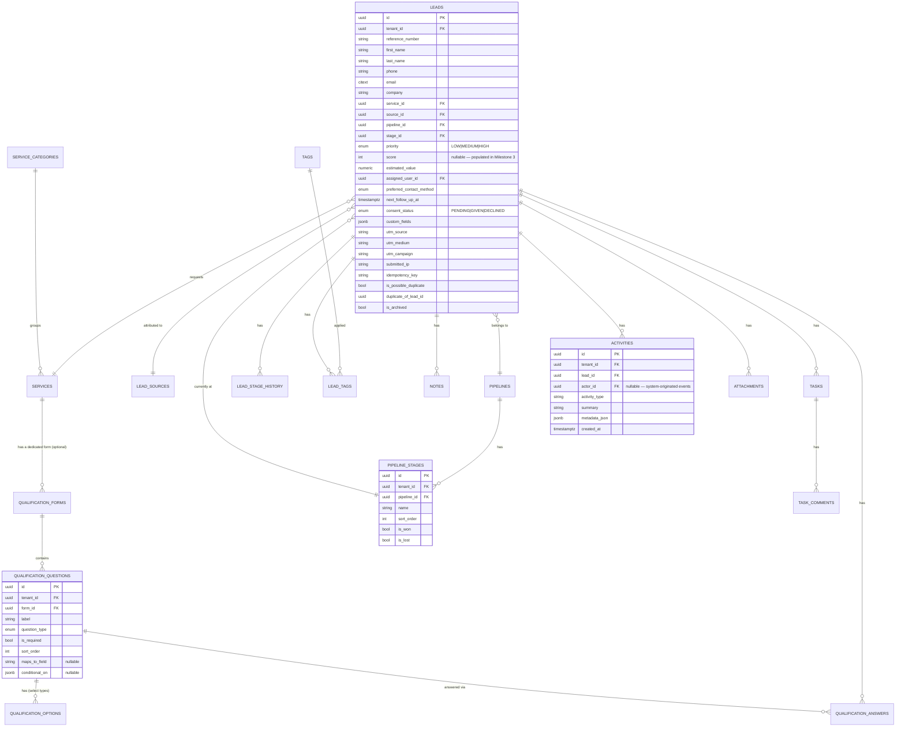
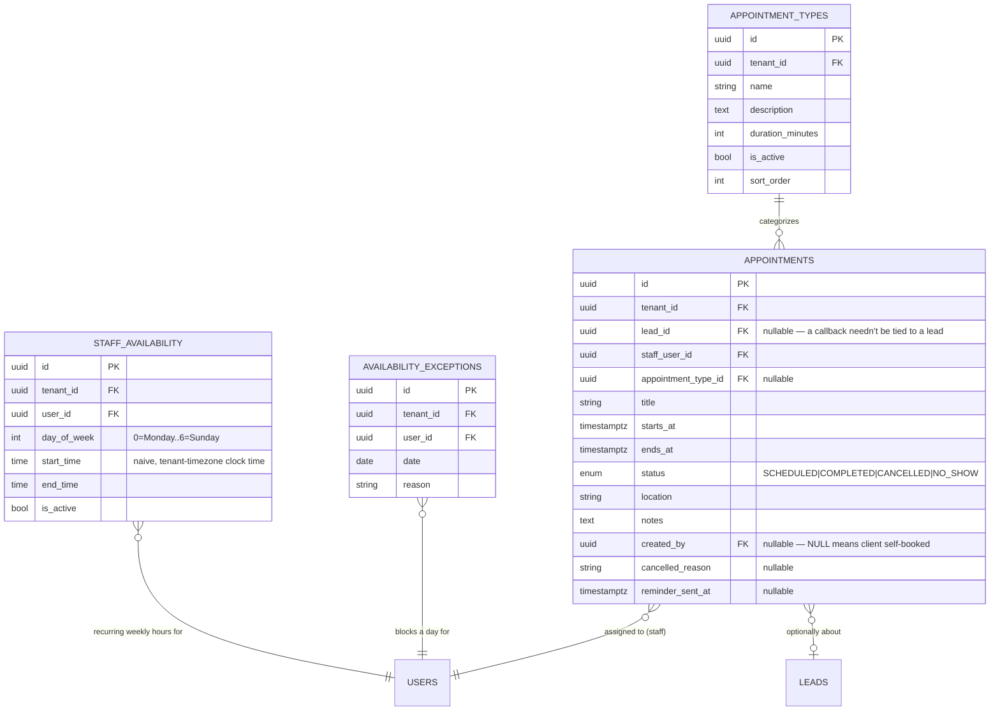
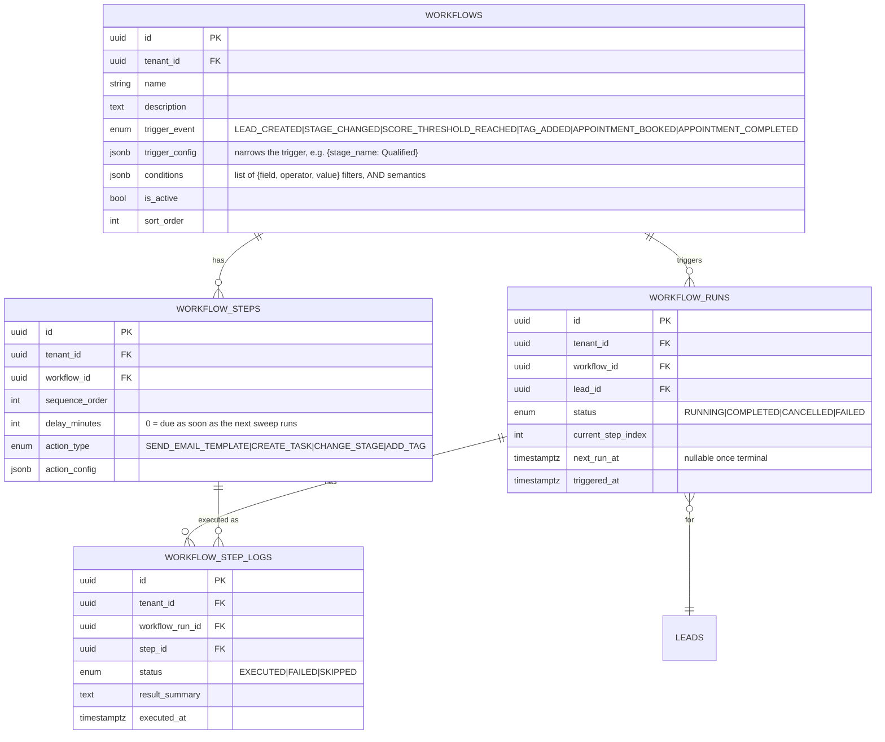
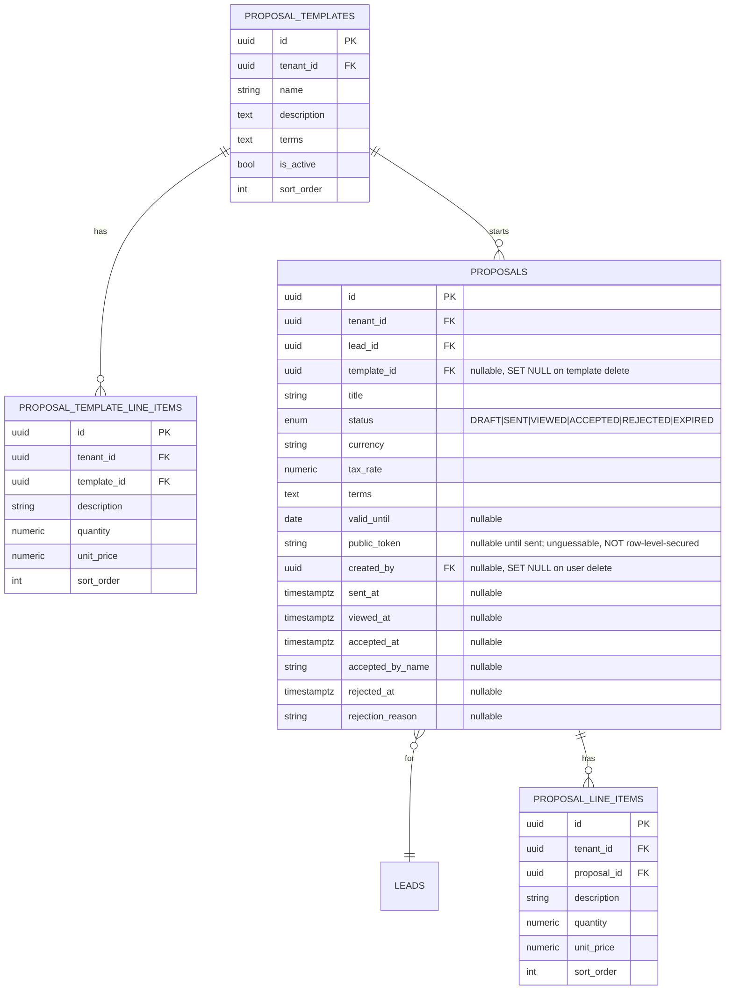
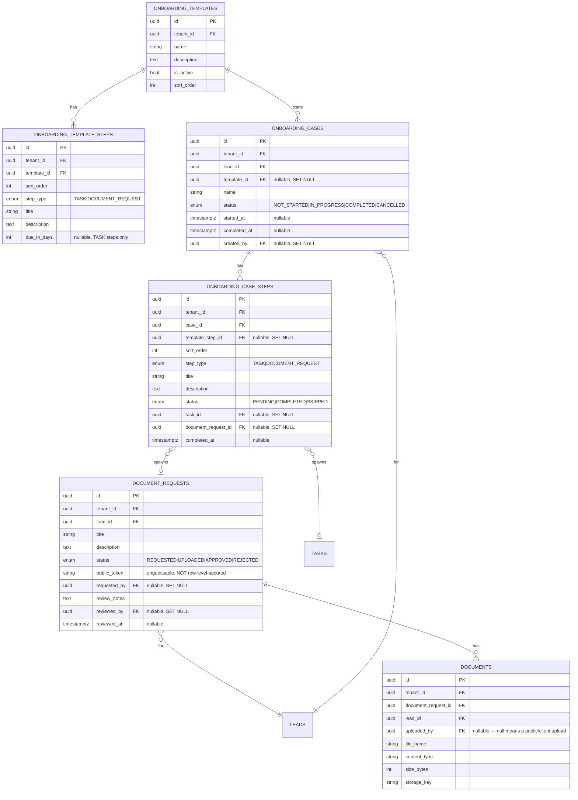

# Database schema

PostgreSQL 16. UUID primary keys throughout. All timestamps stored as
`timestamptz` (UTC). Every tenant-owned table has row-level security
enabled — see `app/alembic/versions/57bf2768a62d_row_level_security_policies.py`
(Milestone 1), `app/alembic/versions/45ce592d6cd5_milestone_2_row_level_security_policies.py`
(Milestone 2), `app/alembic/versions/9fa62b59def2_milestone_3_row_level_security_policies.py`
(Milestone 3), `app/alembic/versions/6900c997221c_milestone_4_row_level_security_policies.py`
(Milestone 4), and `app/alembic/versions/11bc088dd65b_milestone_5_row_level_security_policies.py`
(Milestone 5) for the exact policies and the reasoning behind each one.

## Entity-relationship diagram (as built)

```mermaid
erDiagram
    TENANTS ||--o{ TENANT_SETTINGS : has
    TENANTS ||--o{ TENANT_DOMAINS : has
    TENANTS ||--o{ MEMBERSHIPS : has
    TENANTS ||--o{ ROLES : "scopes (nullable = system template)"
    TENANTS ||--o{ INVITATIONS : issues
    TENANTS ||--o{ TENANT_SUBSCRIPTIONS : has
    TENANTS ||--o{ TENANT_FEATURE_OVERRIDES : has
    TENANTS ||--o{ TENANT_ADD_ONS : has
    TENANTS ||--o{ USAGE_RECORDS : accrues
    TENANTS ||--o{ AUDIT_LOGS : scopes
    TENANTS ||--o{ SUPPORT_ACCESS_LOGS : scopes
    TENANTS ||--o{ FEATURE_CHANGE_LOGS : scopes

    USERS ||--o{ MEMBERSHIPS : holds
    USERS ||--o{ SESSIONS : authenticates
    USERS ||--o{ EMAIL_VERIFICATION_TOKENS : requests
    USERS ||--o{ PASSWORD_RESET_TOKENS : requests

    MEMBERSHIPS }o--|| ROLES : "assigned"
    ROLES ||--o{ ROLE_PERMISSIONS : grants
    ROLE_PERMISSIONS }o--|| PERMISSIONS : references
    INVITATIONS }o--|| ROLES : "grants on accept"

    SUBSCRIPTION_PLANS ||--o{ PLAN_FEATURES : includes
    PLAN_FEATURES }o--|| FEATURES : references
    FEATURES }o--|| MODULES : "belongs to"
    TENANT_SUBSCRIPTIONS }o--|| SUBSCRIPTION_PLANS : subscribes
    TENANT_FEATURE_OVERRIDES }o--|| FEATURES : overrides
    ADD_ONS ||--o{ TENANT_ADD_ONS : purchased
    USAGE_METRICS ||--o{ USAGE_RECORDS : tracked

    TENANTS {
        uuid id PK
        string name
        string slug UK
        enum status "ACTIVE|SUSPENDED|READ_ONLY|ARCHIVED"
        timestamptz created_at
        timestamptz updated_at
    }
    TENANT_SETTINGS {
        uuid id PK
        uuid tenant_id FK
        string timezone "default Asia/Dubai"
        string currency "default AED"
        jsonb branding
        jsonb business_hours
    }
    TENANT_DOMAINS {
        uuid id PK
        uuid tenant_id FK
        string domain UK
        bool is_primary
    }
    USERS {
        uuid id PK
        citext email UK
        string password_hash "Argon2id"
        string first_name
        string last_name
        bool email_verified
        bool is_platform_admin
        bool is_active
    }
    MEMBERSHIPS {
        uuid id PK
        uuid tenant_id FK
        uuid user_id FK
        uuid role_id FK
        enum status "ACTIVE|INVITED|SUSPENDED"
    }
    ROLES {
        uuid id PK
        uuid tenant_id FK "nullable = system template"
        string name
        bool is_system
    }
    PERMISSIONS {
        uuid id PK
        string code UK
        string description
        bool is_platform_permission
    }
    ROLE_PERMISSIONS {
        uuid role_id PK,FK
        uuid permission_id PK,FK
    }
    INVITATIONS {
        uuid id PK
        uuid tenant_id FK
        citext email
        uuid role_id FK
        string token_hash UK
        uuid invited_by FK
        timestamptz expires_at
        timestamptz accepted_at
        timestamptz revoked_at
    }
    SESSIONS {
        uuid id PK
        uuid user_id FK
        string session_token_hash UK
        uuid active_tenant_id FK
        string ip_address
        string user_agent
        timestamptz expires_at
        timestamptz revoked_at
    }
    EMAIL_VERIFICATION_TOKENS {
        uuid id PK
        uuid user_id FK
        string token_hash UK
        timestamptz expires_at
        timestamptz used_at
    }
    PASSWORD_RESET_TOKENS {
        uuid id PK
        uuid user_id FK
        string token_hash UK
        timestamptz expires_at
        timestamptz used_at
    }
    LOGIN_ATTEMPTS {
        uuid id PK
        citext email
        string ip_address
        bool success
        timestamptz created_at
    }
    MODULES {
        uuid id PK
        string code UK
        string name
    }
    FEATURES {
        uuid id PK
        uuid module_id FK
        string code
        string name
        enum feature_type "BOOLEAN|LIMIT"
    }
    SUBSCRIPTION_PLANS {
        uuid id PK
        string code UK
        string name
        bool is_custom
        bool is_active
    }
    PLAN_FEATURES {
        uuid id PK
        uuid plan_id FK
        uuid feature_id FK
        jsonb config
    }
    TENANT_SUBSCRIPTIONS {
        uuid id PK
        uuid tenant_id FK UK
        uuid plan_id FK
        enum status "TRIALING|ACTIVE|PAST_DUE|SUSPENDED|CANCELLED"
        timestamptz current_period_end
        timestamptz trial_ends_at
    }
    ADD_ONS {
        uuid id PK
        string code UK
        jsonb grants
    }
    TENANT_ADD_ONS {
        uuid id PK
        uuid tenant_id FK
        uuid add_on_id FK
        timestamptz starts_at
        timestamptz ends_at
    }
    TENANT_FEATURE_OVERRIDES {
        uuid id PK
        uuid tenant_id FK
        uuid feature_id FK
        jsonb config
        uuid granted_by FK
        timestamptz expires_at
        text reason
    }
    USAGE_METRICS {
        uuid id PK
        string code UK
        string name
        string unit
    }
    USAGE_RECORDS {
        uuid id PK
        uuid tenant_id FK
        uuid metric_id FK
        bigint value
        date period
    }
    AUDIT_LOGS {
        uuid id PK
        uuid tenant_id FK "nullable = platform-level"
        uuid actor_user_id FK
        string action
        string entity_type
        uuid entity_id
        jsonb before
        jsonb after
        timestamptz created_at
    }
    SUPPORT_ACCESS_LOGS {
        uuid id PK
        uuid tenant_id FK
        uuid platform_admin_user_id FK
        text reason
        string resource
        timestamptz created_at
    }
    FEATURE_CHANGE_LOGS {
        uuid id PK
        uuid tenant_id FK
        uuid changed_by FK
        string change_type
        jsonb details
        timestamptz created_at
    }
```

## Entity-relationship diagram — Milestone 2 additions (Lead Capture & CRM)

Kept as a separate diagram rather than merged into the one above for
readability — every table below carries its own `tenant_id` and follows
the plain tenant-match RLS policy (see summary below).



Also added in Milestone 2: `TENANT_CAPTURE_TOKENS` (tenancy module) — a
stable, unguessable public identifier per tenant used by the public lead
capture form, deliberately distinct from the tenant's slug/UUID and
**not** row-level-secured (same reasoning as invitations/sessions — see
below).

## Entity-relationship diagram — Milestone 3 additions (Scoring, Assignment, Communications)

```mermaid
erDiagram
    LEADS ||--o{ LEAD_SCORE_LOGS : "scored, logged for"
    SCORING_RULES ||--o{ LEAD_SCORE_LOGS : "referenced by breakdown"
    ASSIGNMENT_RULES ||--o| ASSIGNMENT_RULE_ROUND_ROBIN_STATE : "tracks cursor for"
    EMAIL_TEMPLATES ||--o{ EMAIL_DELIVERY_LOGS : "rendered into"
    LEADS ||--o{ EMAIL_DELIVERY_LOGS : "notification about"

    SCORING_RULES {
        uuid id PK
        uuid tenant_id FK
        string name
        string field "lead attribute, or answer:<question_id>"
        enum operator "EQUALS|NOT_EQUALS|CONTAINS|GREATER_THAN|LESS_THAN|IS_SET|IN"
        jsonb value
        int points
        int sort_order
        bool is_active
    }
    SCORING_SETTINGS {
        uuid id PK
        uuid tenant_id FK UK
        int hot_threshold
        int warm_threshold
        bool auto_priority
    }
    LEAD_SCORE_LOGS {
        uuid id PK
        uuid tenant_id FK
        uuid lead_id FK
        int total_score
        jsonb breakdown "[{rule_id, rule_name, points}]"
        timestamptz created_at
    }
    ASSIGNMENT_RULES {
        uuid id PK
        uuid tenant_id FK
        string name
        enum strategy "ROUND_ROBIN|SERVICE_BASED|PRIORITY_BASED"
        jsonb conditions
        jsonb eligible_user_ids
        int sort_order
        bool is_active
    }
    ASSIGNMENT_RULE_ROUND_ROBIN_STATE {
        uuid id PK
        uuid tenant_id FK
        uuid rule_id FK UK
        int last_assigned_index
    }
    EMAIL_TEMPLATES {
        uuid id PK
        uuid tenant_id FK
        string name
        enum trigger_event "MANUAL|LEAD_CREATED|LEAD_ASSIGNED|STAGE_CHANGED|TASK_REMINDER"
        string trigger_stage_outcome "nullable — won|lost, STAGE_CHANGED only"
        string subject
        text body_text
        text body_html "nullable"
        bool is_active
    }
    EMAIL_DELIVERY_LOGS {
        uuid id PK
        uuid tenant_id FK
        uuid template_id FK "nullable"
        uuid lead_id FK "nullable"
        string recipient
        string subject
        text body_text "rendered snapshot, resent as-is on retry"
        text body_html "nullable"
        enum status "PENDING|SENT|FAILED"
        int attempt_count
        text last_error "nullable"
        timestamptz sent_at "nullable"
        timestamptz created_at
    }
```

Also added in Milestone 3: `Lead.priority_locked` (set the moment staff
manually change a lead's priority, so scoring's auto-priority mapping
never silently overwrites a human decision) and `Task.reminder_sent_at`
(idempotency marker for the task-reminder sweep).

## Entity-relationship diagram — Milestone 4 additions (Booking)



`StaffAvailability.start_time`/`end_time` are naive clock times
interpreted in the tenant's configured timezone
(`TenantSettings.timezone`) and converted to UTC only at slot-computation
time (`app/modules/booking/service.py::compute_available_slots`, using
Python's stdlib `zoneinfo` — no new dependency). `Appointment.starts_at`/
`ends_at` are always stored as real UTC `timestamptz` values, same as
every other timestamp in the schema. Double-booking is prevented by
re-checking for an overlapping `SCHEDULED` appointment under a row lock
(`AppointmentRepository.find_overlapping`, `SELECT ... FOR UPDATE`)
immediately before insert — a slot the client saw a moment earlier is
never trusted blindly.

## Entity-relationship diagram — Milestone 5 additions (Workflow Automation)



Every step — including `delay_minutes=0` ones — executes only via the
Celery beat sweep (`process_due_steps_for_tenant`, called from
`apps/worker/app/tasks/workflow_automation.py`), never synchronously at
trigger time; see the module docstring in
`app/modules/workflow_automation/service.py` for why. A step that raises
is logged as `FAILED` in `workflow_step_logs` but the run still advances
to the next step rather than getting permanently stuck — the same
best-effort philosophy already applied to email delivery.

## Entity-relationship diagram — Milestone 6 additions (Proposals)



Subtotal/tax/total are deliberately **not** stored columns — they're
computed on-the-fly from line items in `proposals.service.compute_totals`
every time a proposal is read, so a stored total can never drift out of
sync with the line items it's derived from (the same reasoning this
codebase already applies elsewhere to avoid denormalized/cached derived
state).

`proposals.public_token` is the client-facing acceptance page's
authorization proof — raw (unhashed), unguessable, generated only when a
proposal is sent (`send_proposal`), and looked up directly by
`ProposalRepository.get_by_public_token`, the same pattern already used
for `tenant_capture_tokens`. See the row-level security summary below for
why the `proposals` table itself is excluded from RLS while
`proposal_templates`, `proposal_template_line_items`, and
`proposal_line_items` are not.

## Entity-relationship diagram — Milestone 7 additions (Document Collection & Client Onboarding)



`onboarding_case_steps.task_id`/`document_request_id` point at the real
`Task`/`DocumentRequest` row a step spawned when its case started —
`crm.service.complete_task` and
`documents.service.approve_document_request` each call back into
`onboarding.service` (soft no-op if the task/request isn't tied to any
case) to advance the matching step, and the case auto-completes once
every step is done. `document_requests.public_token` is the client-facing
upload page's authorization proof — raw, unguessable, generated at
request-creation time, the same pattern as `Proposal.public_token`.

## Row-level security summary

| Table | Policy |
|---|---|
| `tenant_settings`, `tenant_domains`, `memberships`, `tenant_subscriptions`, `tenant_feature_overrides`, `tenant_add_ons`, `usage_records`, `support_access_logs`, `feature_change_logs` | `tenant_id` matches session context, or platform admin |
| `memberships` | additionally: `user_id` matches session context (own rows) — needed pre-tenant-selection |
| `tenants` | current tenant, platform admin, or caller has an active membership in it |
| `roles` | current tenant, `NULL` tenant (system templates), platform admin, or caller holds that role |
| `audit_logs` | reads tenant-restricted; **inserts unrestricted** (see migration docstring — audit writes must never be blocked by the very policy meant to protect reads of them) |
| `service_categories`, `services`, `qualification_forms`, `qualification_questions`, `qualification_options`, `qualification_answers`, `custom_field_definitions`, `custom_field_options`, `lead_sources`, `leads`, `pipelines`, `pipeline_stages`, `lead_stage_history`, `tags`, `lead_tags`, `notes`, `tasks`, `task_comments`, `activities`, `attachments`, `scoring_rules`, `scoring_settings`, `lead_score_logs`, `assignment_rules`, `assignment_rule_round_robin_state`, `email_templates`, `email_delivery_logs`, `appointment_types`, `staff_availability`, `availability_exceptions`, `appointments`, `workflows`, `workflow_steps`, `workflow_runs`, `workflow_step_logs`, `proposal_templates`, `proposal_template_line_items`, `proposal_line_items`, `documents`, `onboarding_templates`, `onboarding_template_steps`, `onboarding_cases`, `onboarding_case_steps` | `tenant_id` matches session context, or platform admin — plain policy, since every route reaching these tables already has a selected tenant (public lead capture and public booking both explicitly set that context from their capture token before touching any of them; the Celery beat sweeps in `apps/worker/app/tasks/communications.py`, `apps/worker/app/tasks/booking.py`, and `apps/worker/app/tasks/workflow_automation.py` set `is_platform_admin=true` for their whole run and scope every query by an explicit `tenant_id` parameter instead) |
| `invitations`, `sessions`, `email_verification_tokens`, `password_reset_tokens`, `login_attempts`, `tenant_capture_tokens` | **not** row-level-secured — looked up only by unguessable secret token hash, the token itself is the authorization proof |
| `proposals` | **not** row-level-secured, for the same reason as `tenant_capture_tokens`: the public acceptance page (`GET /public/proposals/{token}`) must resolve the owning tenant from `proposals.public_token` before any tenant context exists — see `app.modules.proposals.service.get_proposal_by_token`, which calls `set_rls_context` immediately afterward. Unlike the token tables above, `proposals` also has an authenticated, tenant-scoped read path (`GET /tenant/proposals`); every method on `ProposalRepository` filters explicitly by `tenant_id` in the query itself, the same application-level boundary `tenant_capture_tokens` already relies on for its own authenticated read path. Its child tables (`proposal_line_items`) carry no public token and remain row-level-secured normally |
| `document_requests` | **not** row-level-secured, the same reasoning as `proposals`: the public upload page (`GET`/`POST /public/documents/{token}...`) must resolve the owning tenant from `document_requests.public_token` before any tenant context exists — see `app.modules.documents.service.get_request_by_token`. Its child table `documents` (the uploaded files) carries no public token and remains row-level-secured normally |
| `users`, `modules`, `features`, `subscription_plans`, `plan_features`, `add_ons`, `permissions`, `role_permissions`, `usage_metrics` | global catalog/account data, no tenant_id column, no RLS |

## Migrations

Milestone 1:
1. `1a62ff428104_milestone_1_core_schema.py` — every table, index, and constraint.
2. `57bf2768a62d_row_level_security_policies.py` — RLS enablement and policies.

Milestone 2:
3. `235868a48cb8_milestone_2_lead_capture_and_crm_schema.py` — services, qualification forms, leads, pipelines, notes, tasks, tags, attachments, activities.
4. `45ce592d6cd5_milestone_2_row_level_security_policies.py` — RLS for all of the above.
5. `80b63d28fe69_add_tenant_capture_tokens.py` — the public lead-capture token table, with a data backfill for any tenant created before this migration.

Milestone 3:
6. `c8f73ca17737_milestone_3_scoring_assignment_communications_schema.py` — scoring rules/settings/logs, assignment rules/round-robin state, email templates/delivery logs, plus `leads.priority_locked` (server-default `false`, since `leads` already has rows by this point) and `tasks.reminder_sent_at`.
7. `9fa62b59def2_milestone_3_row_level_security_policies.py` — RLS for all of the above.

Milestone 4:
8. `25ca81e21512_milestone_4_booking_schema.py` — appointment types, staff availability, availability exceptions, appointments, plus widening `email_templates.trigger_event` from VARCHAR(20) to VARCHAR(30) for the three new booking trigger event values (a plain column-width change, not a type migration, since the column is `native_enum=False`).
9. `6900c997221c_milestone_4_row_level_security_policies.py` — RLS for all of the above.

Milestone 5:
10. `4f265a2eb695_milestone_5_workflow_automation_schema.py` — workflows, workflow steps, workflow runs, workflow step logs.
11. `11bc088dd65b_milestone_5_row_level_security_policies.py` — RLS for all of the above.

Milestone 6:
12. `e084e0d7c566_milestone_6_proposals_schema.py` — proposal templates, proposal template line items, proposals, proposal line items. No enum-column width migration needed: the two new `EmailTriggerEvent` values (`proposal_sent`, `proposal_accepted`, `proposal_rejected`) and two new `WorkflowTriggerEvent` values (`proposal_accepted`, `proposal_rejected`) fit within the `VARCHAR(30)` width both columns were already widened to in Milestone 4.
13. `476edb3b5396_milestone_6_row_level_security_policies.py` — RLS for `proposal_templates`, `proposal_template_line_items`, and `proposal_line_items` only; `proposals` itself is deliberately excluded (see the row-level security summary above).

Milestone 7:
14. `d71e840aed0d_milestone_7_documents_and_onboarding_schema.py` — onboarding templates, onboarding template steps, document requests, onboarding cases, documents, onboarding case steps. No enum-column width migration needed: the three new `EmailTriggerEvent` values (`document_requested`, `document_approved`, `document_rejected`) and the new `WorkflowActionType` value (`start_onboarding_case`) all fit within the existing `VARCHAR(30)` widths.
15. `940c9dc6be34_milestone_7_row_level_security_policies.py` — RLS for `documents`, `onboarding_templates`, `onboarding_template_steps`, `onboarding_cases`, and `onboarding_case_steps`; `document_requests` itself is deliberately excluded, the same reasoning as `proposals` in Milestone 6 (see the row-level security summary above).

See `infrastructure/deployment/README.md` for how to run, roll back, and
operate migrations in production, plus connection pooling, backup, and
restore-testing guidance.

## Seed data

`app/db/seed/run.py` (idempotent, safe to re-run) seeds:
- The full permission catalog (`app/modules/permissions/catalog.py`).
- The module/feature/plan/add-on commercial-model catalog
  (`app/db/seed/catalog.py`).
- A platform super admin account.
- A demo tenant ("Rafana Advisory Demo — Fictional Demo Data", Growth
  plan) with three demo users (Tenant Owner, Manager, Sales Agent), the
  Professional Services template (9 default services, a 9-question
  qualification form, the 10-stage default pipeline), the Engagement
  Operations template (4 scoring rules, 1 round-robin assignment rule,
  6 email templates covering every trigger event, 2 default appointment
  types, Mon–Fri 09:00–17:00 availability for the Tenant Owner, and a
  2-step "New Lead Welcome Sequence" workflow demonstrating a delayed
  step), and 3 fictional demo leads with a note each — each of which is
  scored, auto-assigned, triggers a real (though soft-failing-if-
  unreachable) notification send, and fires the welcome workflow through
  the same code path a production lead would use.

`app/db/seed/professional_services_template.py` applies the Professional
Services template and `app/db/seed/engagement_operations_template.py`
applies the Engagement Operations template to every newly created tenant
(both called from `platform_admin.service.create_tenant_with_owner`), not
just the seeded demo tenant.

All demo data is clearly labelled as fictional; no real personal
information is used.
